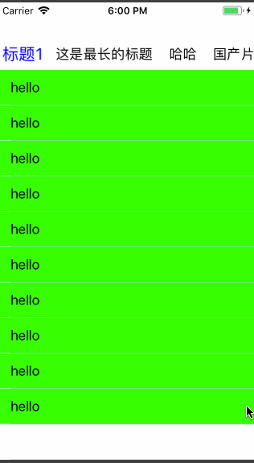

# CHPageView



常见的分页功能，滑动导航栏,几句话搞定！

```objective-c
CHPageView *vi = [[CHPageView alloc] initWithFrame:self.view.bounds];
    [vi configWithParent:self titleArray:@[@"标题1",@"这是最长的标题",@"哈哈",@"国产片",@"最后一个标题",@"标题1",@"这是最长的标题",@"哈哈",@"国产片",@"最后一个标题"] childVc:@[[TestTableViewController new],[TestTableViewController new],[TestViewController new],[TestTableViewController new],[TestViewController new],[TestTableViewController new],[TestTableViewController new],[TestViewController new],[TestTableViewController new],[TestViewController new]]];
    vi.frame = CGRectMake(0, 44, self.view.bounds.size.width, self.view.bounds.size.height - 44);
    [self.view addSubview:vi];
```


